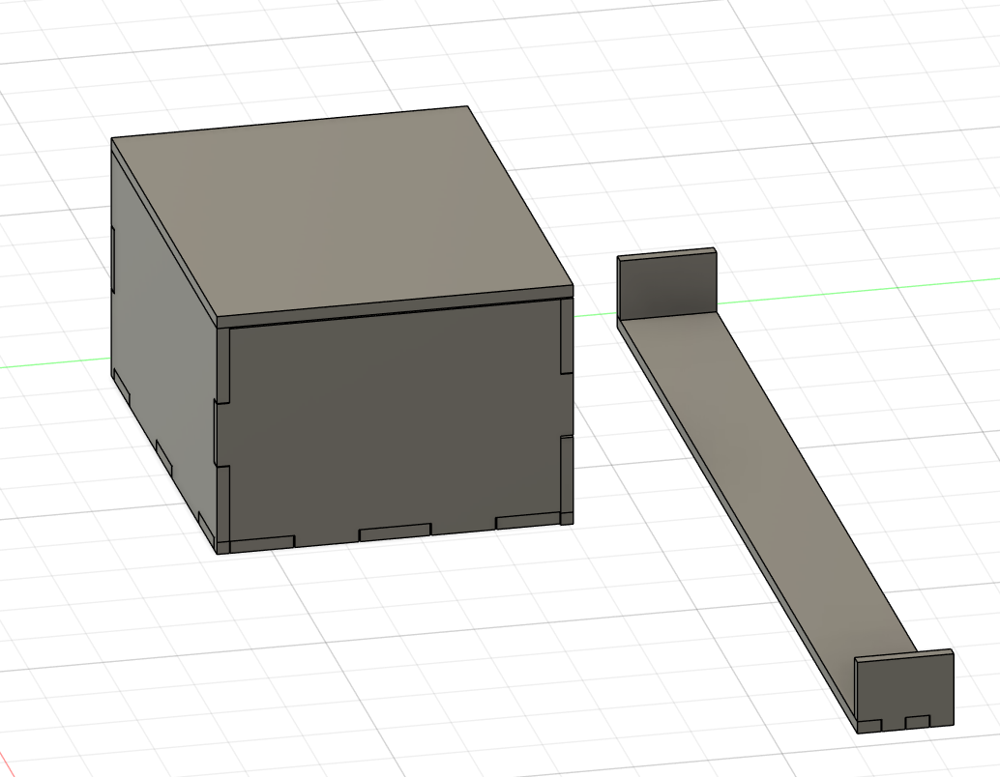
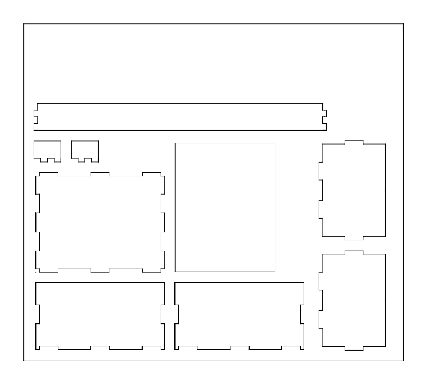
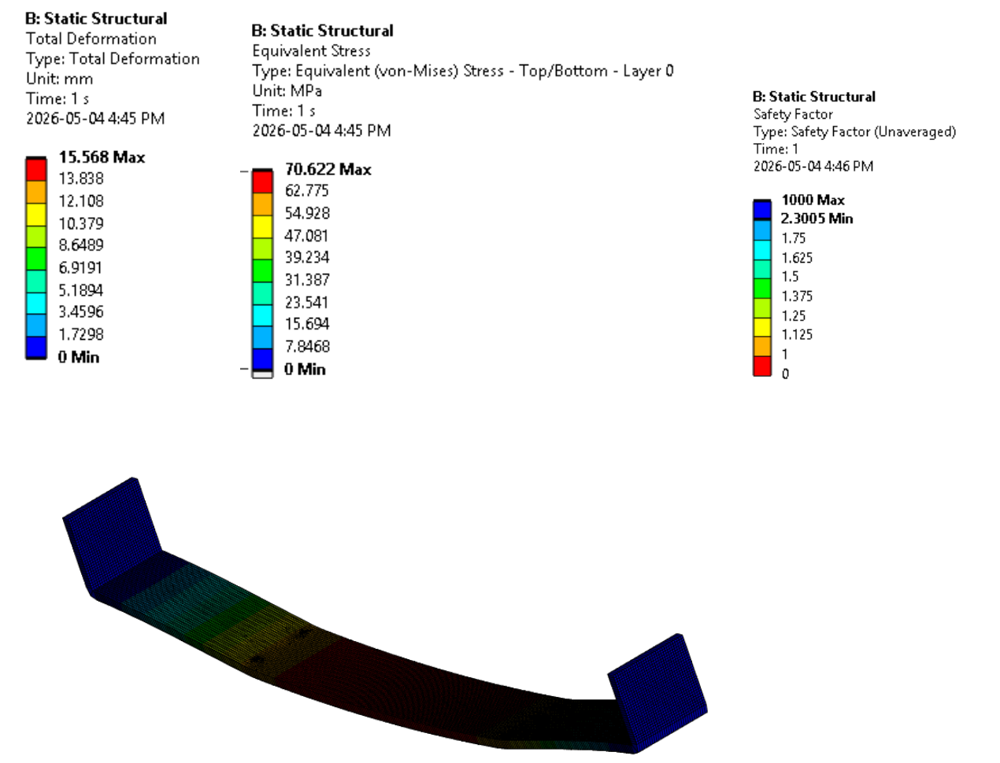

# 📦 PPT Composite Box Design

Lightweight composite box enclosure designed for waterjet manufacturing, structural performance, and manufacturable assembly.

---

## 📐 Overview

This project involved the design and verification of a composite-compatible enclosure using CAD modeling, nested DXF manufacturing layouts, and structural FEA analysis.

### Key Objectives
- Lightweight structural design
- Waterjet manufacturability
- Tab-based assembly alignment
- Structural stiffness verification
- Composite manufacturing compatibility

---

## 🛠️ Software Used

- Fusion 360
- ANSYS Mechanical
- CATIA V5

---

## 🧵 Composite Layup Structure

The enclosure was designed using a hybrid composite sandwich structure consisting of:

- Kevlar outer layer
- Carbon fiber layer
- 1/4 inch Divinycell core
- Carbon fiber layer
- Kevlar inner layer

This layup configuration was selected to balance:
- Impact resistance
- Structural stiffness
- Lightweight performance
- Energy absorption
- Composite manufacturability

---

## 📦 Final Assembly

The final enclosure assembly was verified in CAD to ensure:
- Proper tab alignment
- Manufacturable tolerances
- Correct mating geometry
- Assembly feasibility

---

## ✂️ Waterjet DXF Layout

The enclosure faces were flattened and nested to:
- Optimize material usage
- Remain within manufacturing constraints
- Prepare for CNC/waterjet cutting

---

## 📊 Structural FEA Analysis

ANSYS simulations were conducted to evaluate:
- Structural deflection
- Stress concentration regions
- Potential failure locations
- Enclosure stiffness under loading

---

## 🧵 Design Features

- Puzzle-fit rectangular tabs
- Composite-oriented enclosure geometry
- Waterjet-ready flat patterns
- CAD assembly validation
- Structural verification using FEA

---

## 📁 Included Files

| File | Description |
|---|---|
| `PPT_Box_Final_Assembly.step` | Final 3D CAD assembly |
| `waterjet_layout.dxf` | Waterjet manufacturing layout |
| `final_assembly.png` | Final CAD assembly render |
| `waterjet_dxf_layout.png` | Nested DXF cutting layout |
| `ansys_fea_results.png` | Structural simulation results |
