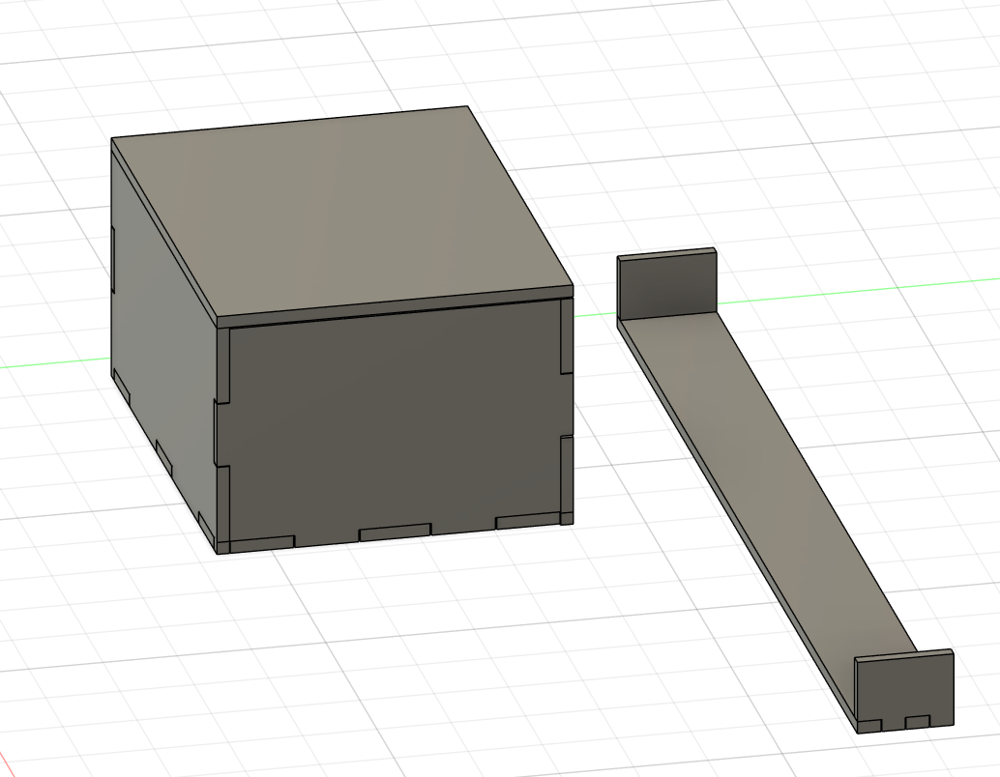
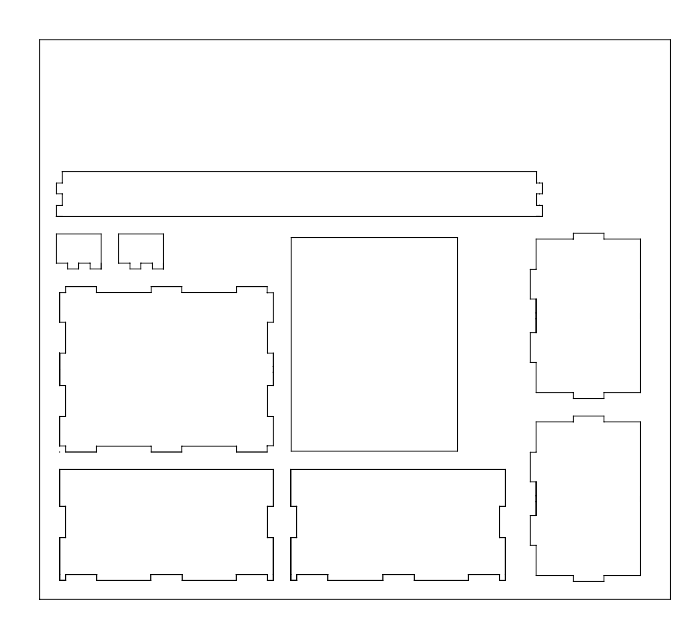
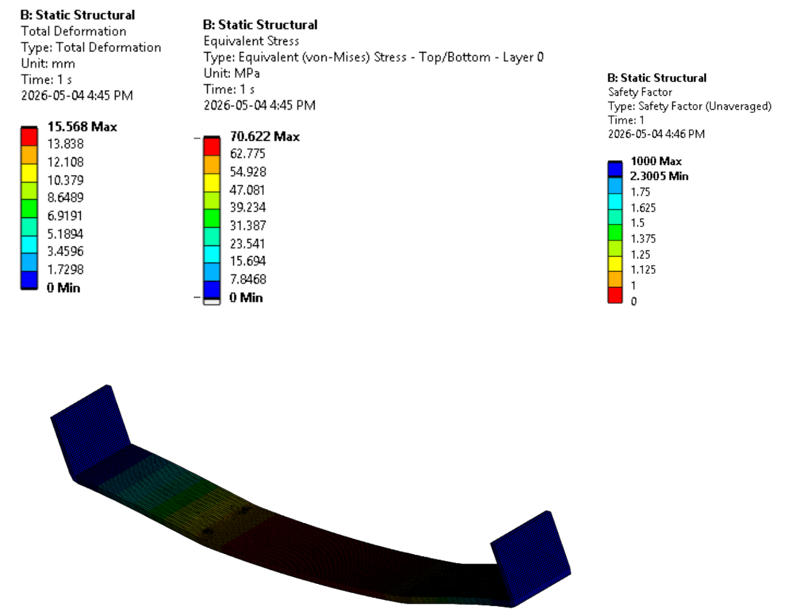
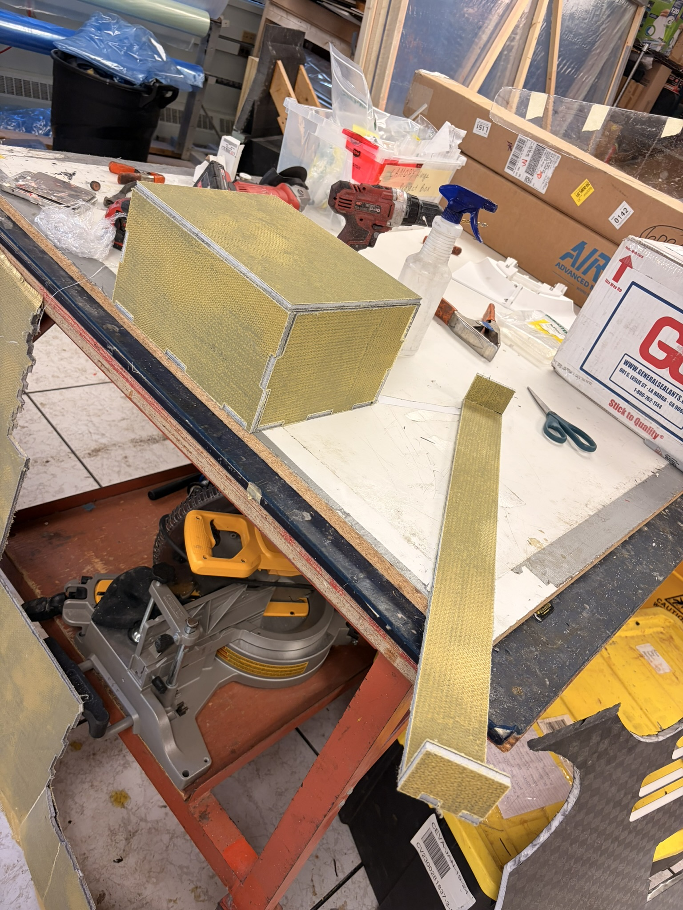
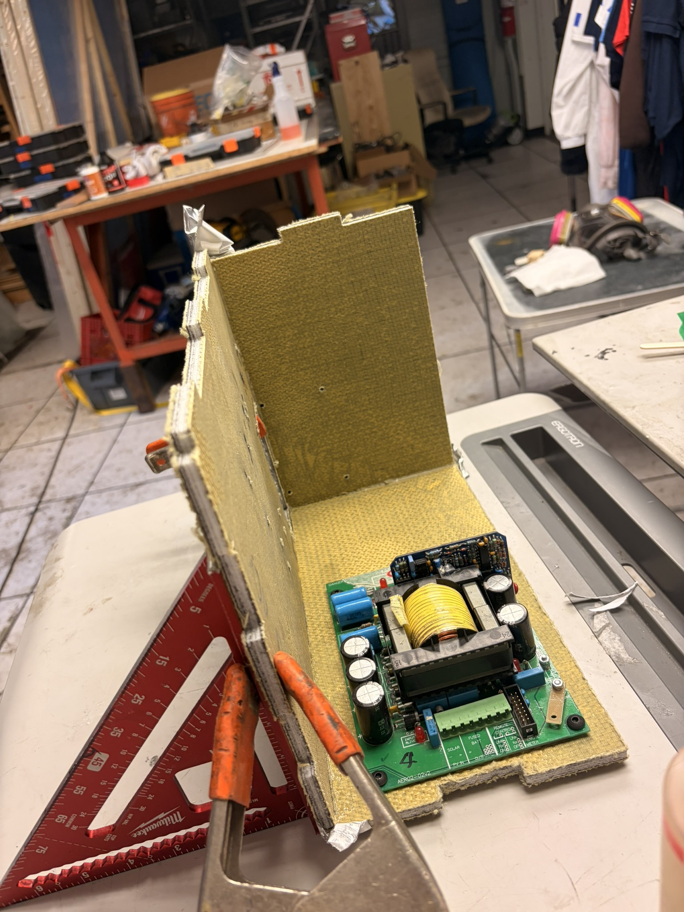
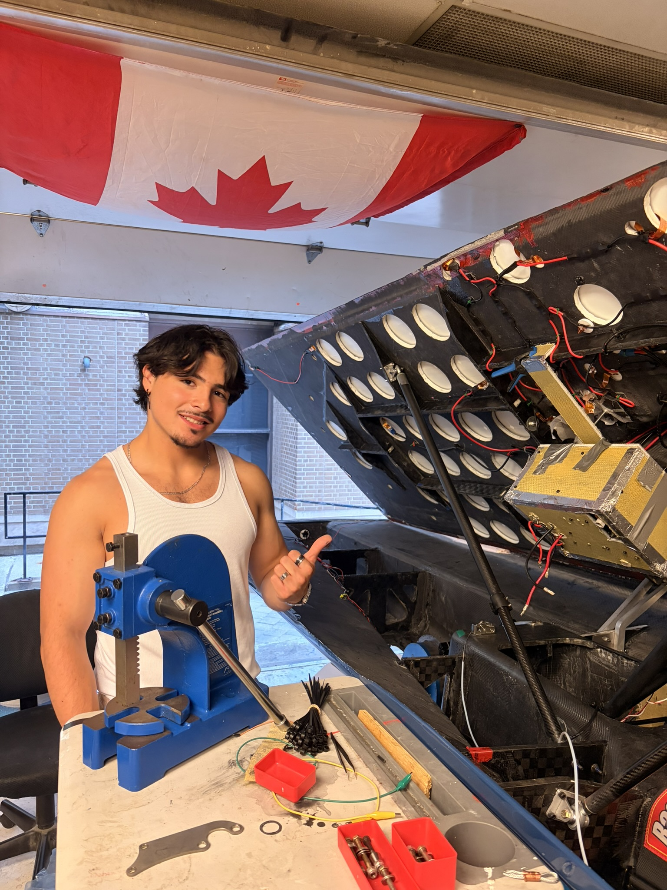

# 📦 PPT Composite Box Design

Lightweight composite box enclosure designed for waterjet manufacturing, structural performance, and manufacturable assembly.

---

## 📐 Overview

This project involved the design, manufacturing, and verification of a composite enclosure using CAD modeling, nested DXF manufacturing layouts, structural FEA analysis, waterjet cutting, and physical assembly.

### Key Objectives

- Lightweight structural design
- Waterjet manufacturability
- Tab-based assembly alignment
- Structural stiffness verification
- Composite manufacturing compatibility
- Practical assembly and fabrication

---

## 🛠️ Software Used

- Fusion 360
- ANSYS Mechanical
- CATIA V5

---

## 🧵 Composite Layup Structure

The enclosure was designed using a hybrid composite sandwich structure consisting of:

- Kevlar outer layer
- Carbon fiber layer
- 1/4 inch Divinycell core
- Carbon fiber layer
- Kevlar inner layer

This layup configuration was selected to balance:

- Impact resistance
- Structural stiffness
- Lightweight performance
- Energy absorption
- Composite manufacturability
- Electrical insulation

---

## 📦 Final Assembly

  

The final enclosure assembly was verified in CAD to ensure:

- Proper tab alignment
- Manufacturable tolerances
- Correct mating geometry
- Assembly feasibility

---

## ✂️ Waterjet DXF Layout

  

The enclosure faces were flattened and nested to:

- Optimize material usage
- Remain within manufacturing constraints
- Prepare for CNC/waterjet cutting

---

## 📊 Structural FEA Analysis

  

ANSYS simulations were conducted to evaluate:

- Structural deflection
- Stress concentration regions
- Potential failure locations
- Enclosure stiffness under loading

---

## 🔧 Manufacturing & Assembly

Following the completion of the CAD and simulation stages, the enclosure was physically manufactured and assembled from the composite panels.

### Waterjet-Cut Composite Faces

  

The individual composite enclosure faces were produced from the finalized flat-pattern geometry. The puzzle-fit tab design helped maintain alignment between panels while converting the original CAD assembly into manufacturable components.

### Epoxy Assembly

  

The enclosure faces were aligned and bonded using epoxy to form the final structure. This stage provided an opportunity to evaluate the practical fit of the tab geometry, manufacturing tolerances, and overall assembly process.

### Completed Composite Box

  

The completed enclosure demonstrated the full design-to-manufacturing workflow, progressing from CAD geometry and structural analysis to waterjet-cut composite panels and final bonded assembly.

---

## 🧵 Design Features

- Puzzle-fit rectangular tabs
- Composite-oriented enclosure geometry
- Waterjet-ready flat patterns
- CAD assembly validation
- Structural verification using FEA
- Epoxy-bonded panel construction
- Design validated through physical fabrication

---

## ✅ Project Conclusion

The completed PPT composite box successfully progressed from an initial enclosure concept to a physically manufactured assembly. CAD modeling was used to develop the enclosure geometry and tab system, while ANSYS FEA provided structural verification prior to fabrication. The individual composite panels were then prepared as nested DXF files, waterjet cut, and epoxy bonded into the final enclosure.

Manufacturing the design also provided practical validation of the panel geometry, tab alignment, tolerances, and assembly method. The project demonstrated an end-to-end engineering workflow combining composite material selection, mechanical design, simulation, design for manufacturing, and hands-on fabrication.

---

## 📁 Included Files

| File                          | Description                            |
| ----------------------------- | -------------------------------------- |
| `PPT_Box_Final_Assembly.step` | Final 3D CAD assembly                  |
| `waterjet_layout.dxf`         | Waterjet manufacturing layout         |
| `final_assembly.png`          | Final CAD assembly render              |
| `waterjet_dxf_layout.png`     | Nested DXF cutting layout              |
| `ansys_fea_results.png`       | Structural simulation results          |
| `faceCutout.JPEG`             | Waterjet-cut composite enclosure face  |
| `epoxyingbox.JPEG`            | Epoxy bonding and assembly process     |
| `CompleteBox.JPEG`            | Completed physical composite enclosure |
